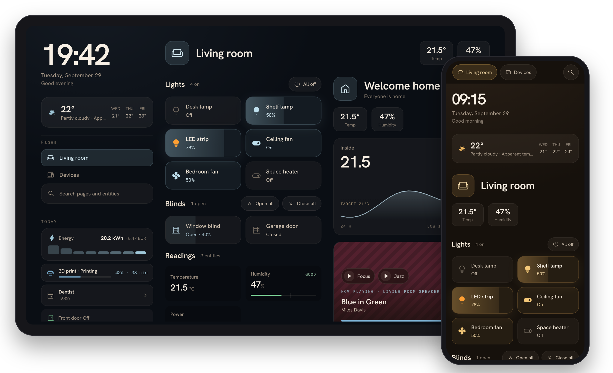

# Hearth

Hearth is a Home Assistant dashboard for wall tablets, phones and desktops. It shows your rooms, devices and daily information in a layout you arrange with a visual editor. A day and a night theme switch with an entity such as `sun.sun`.

I built Hearth for the tablet on my wall.

Hearth is pre-1.0. The configuration format and features can still change between minor releases; breaking changes are listed in the [changelog](CHANGELOG.md).



## Features

- Visual editor: drag cards and widgets, edit them in place, undo and redo, or edit the YAML directly.
- Area import that builds a page for each Home Assistant area from its lights, covers, climate, media, cameras and other devices.
- Layouts for tablets, phones and desktops. A sidebar holds clocks, weather, page navigation, calendars, energy, timers, notifications and other widgets. Place it on the left, the right or both sides, or hide it.
- Swipe between pages on phones, and with a mouse drag on wider screens.
- Theme presets, background images and custom CSS.
- Cards for entities, headers, sensors, climate, media, vacuums, cameras, images, scenes, web pages and more.
- Camera playback over WebRTC or HLS, with a still image as fallback.
- Alerts from dashboard rules or Home Assistant automations, shown as popups and in the notifications widget.
- Sleep screen with a clock, the current weather and an image or live weather radar map behind it.
- Search across pages and entities, and a detail sheet with state, attributes and history for any entity.

## Not supported yet

Hearth has no picture-elements card (an image with entity overlays), no calendar or to-do editing and no map of tracked devices. Entities without dedicated controls open a detail sheet with state, attributes and history.

## Install

### Home Assistant app

On Home Assistant OS or Supervised, install Hearth as an app (formerly called an add-on). Add the app repository:

[](https://my.home-assistant.io/redirect/supervisor_add_addon_repository/?repository_url=https%3A%2F%2Fgithub.com%2Fknowald%2Faddon-ha-hearth)

Or add it by hand: go to Settings > Apps, select Install app, then Repositories in the top-right menu, and paste `https://github.com/knowald/addon-ha-hearth`. Install Hearth from the list.

The app shows up in the Home Assistant sidebar through Ingress. For wall tablets, set a port in the app configuration, set Home Assistant URL for direct access to an address the tablet can reach (for example `http://homeassistant.local:8123`), restart the app and open Hearth on that port. See [direct access](https://github.com/knowald/addon-ha-hearth#direct-access). Configuration is stored on the app's volume and survives updates.

The repository also offers Hearth (beta) and Hearth (edge); see the [app channels](https://github.com/knowald/addon-ha-hearth#channels).

### Docker

Prebuilt images are published to `ghcr.io/knowald/ha-hearth`. Use `latest` for stable releases, a version such as `0.5.0` to pin one, `beta` for prereleases or `edge` for the development branch:

```sh
docker run -d --name hearth --restart unless-stopped \
  -p 5050:5050 \
  -v "$PWD/data:/app/data" \
  -e HASS_URL=http://homeassistant.local:8123 \
  ghcr.io/knowald/ha-hearth:latest
```

To build from source with Docker Compose instead:

```sh
git clone https://github.com/knowald/ha-hearth.git
cd ha-hearth
cp .env.docker.example .env.docker
# Set HASS_URL in .env.docker
docker compose --env-file .env.docker up -d --build
```

Both listen on port 5050 and keep the configuration in `./data` by default.

### Node

Requires Node.js 22 or newer and pnpm 10 or newer.

```sh
git clone https://github.com/knowald/ha-hearth.git
cd ha-hearth
pnpm install --frozen-lockfile
pnpm build
HASS_URL=http://homeassistant.local:8123 PORT=5050 node server.js
```

Configuration is kept in `./data` under the directory you start the server from.

### Home Assistant URL

Set `HASS_URL` to an address the Hearth server can reach. If the browser cannot reach that address (for example `http://homeassistant:8123` inside Docker), also set `HASS_PUBLIC_URL` to one it can. Use an HTTPS address when Hearth is served over HTTPS. See [configuration](docs/configuration.md#environment-variables).

## First run

Open Hearth and sign in through Home Assistant. Hearth offers to import your Home Assistant areas as pages; choose Skip for now to start from an empty page. To add cards and widgets, press Edit Hearth configuration.

In the Home Assistant companion app, sign in with a long-lived access token instead: create one in your Home Assistant profile under Security and enter it when Hearth asks.

## Security

Hearth has no user accounts of its own. Anyone who can reach it can change the dashboard and its settings. If you enter a long-lived access token in Application settings, Hearth stores it in `configuration.yaml` and sends it to every browser that opens Hearth. Run Hearth on a trusted network or behind an authenticated reverse proxy, and keep the data directory private.

## Documentation

- [Configuration](docs/configuration.md): data files, environment variables, URL options, sleep screen, custom CSS and JavaScript, touch feedback.
- [Alerts](docs/alerts.md): alert rules and the `HEARTH` event for automations.
- [Changelog](CHANGELOG.md).

For contributors: [development](docs/development.md), [architecture](docs/architecture.md), [component conventions](src/lib/Hearth/README.md) and [releasing](docs/release.md).

## License

[MIT](LICENSE). Copyright Kevin Nowald. Hearth includes code from ha-fusion, copyright Mattias Persson.

## Thanks

Hearth started as a rework of [ha-fusion](https://github.com/matt8707/ha-fusion) by matt8707 and grew into its own dashboard. Thank you for the project that made Hearth possible. A maintained continuation of the original lives at [knowald/ha-fusion](https://github.com/knowald/ha-fusion).

Hearth does not import ha-fusion's `dashboard.yaml`. If you are coming from ha-fusion, import your areas and rebuild from there.
